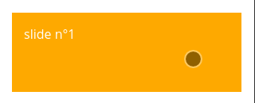

# React swipeable views

> A React component for swipeable views.

[](https://www.npmjs.com/package/react-swipeable-views)
[](https://www.npmjs.com/package/react-swipeable-views)
[](https://travis-ci.org/oliviertassinari/react-swipeable-views)

[](https://david-dm.org/oliviertassinari/react-swipeable-views)
[](https://david-dm.org/oliviertassinari/react-swipeable-views#info=devDependencies&view=list)

Check out the [demos](http://oliviertassinari.github.io/react-swipeable-views/) from a mobile device (real or emulated).
It is tiny (<4kB) and quickly render the first slide then lasy-load the other.

## Installation

```sh
npm install react-swipeable-views
```

## Usage


```js
import React from 'react';
import SwipeableViews from 'react-swipeable-views';

const MyComponent = () => (
  <SwipeableViews>
    <div style={Object.assign({}, styles.slide, styles.slide1)}>
      slide n°1
    </div>
    <div style={Object.assign({}, styles.slide, styles.slide2)}>
      slide n°2
    </div>
    <div style={Object.assign({}, styles.slide, styles.slide3)}>
      slide n°3
    </div>
  </SwipeableViews>
);

const styles = {
  slide: {
    padding: 15,
    minHeight: 100,
    color: '#fff',
  },
  slide1: {
    background: '#FEA900',
  },
  slide2: {
    background: '#B3DC4A',
  },
  slide3: {
    background: '#6AC0FF',
  },
};

export default MyComponent;
```

## Properties

- **children** *Node* - Use this property to provide your slides.

- **containerStyle** *Object, default={}* - This is the inlined style that will be applied
to each slide container.

- **disabled** *Boolean, default=false* - If true, it will disable touch events.
This is useful when you want to prohibit the user from changing slides.

- **index** *Integer, default=0* - This is the index of the slide to show.
This is useful when you want to change the default slide shown.
Or when you have tabs linked to each slide.

- **onChangeIndex** *Function(index, fromIndex)* - This is callback prop. It's call by the
component when the shown slide change after a swipe made by the user.
This is useful when you have tabs linked to each slide.

- **onSwitching** *Function(index)* - This is callback prop. It's called by the
component when the slide switching.
This is useful when you want to implement something corresponding to the current slide position.

- **resistance** *Boolean, default=false* - If true, it will add bounds effect on the edges.

- **style** *Object, default={}* - This is the inlined style that will be applied
on the root component.

- **threshold** *Integer, default=5* - This is the threshold used for detectinga quick swipe.
If the computed speed is above this value, the index change.

Any other properties like `className` will be applied to the root component.

## License

MIT
