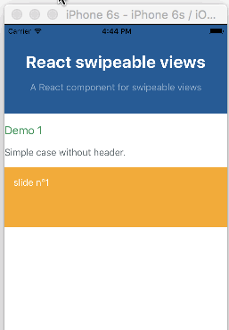
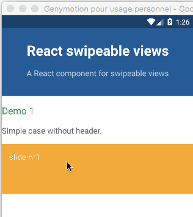

# react-swipeable-views

> A React component for swipeable views.

[](https://www.npmjs.com/package/react-swipeable-views)
[](https://www.npmjs.com/package/react-swipeable-views)
[](https://travis-ci.org/oliviertassinari/react-swipeable-views)

[](https://david-dm.org/oliviertassinari/react-swipeable-views)
[](https://david-dm.org/oliviertassinari/react-swipeable-views#info=devDependencies&view=list)

[](http://definitelytyped.org)

## Installation

```sh
npm install --save react-swipeable-views react-motion
```

## The problem solved

Check out the [demos](http://oliviertassinari.github.io/react-swipeable-views/) from a mobile device (real or emulated).
It is tiny (<4kB) and quickly render the first slide then lasy-load the other.

## Simple example


### Browser

```js
import React from 'react';
import SwipeableViews from 'react-swipeable-views';

const MyComponent = () => (
  <SwipeableViews>
    <div style={Object.assign({}, styles.slide, styles.slide1)}>
      slide n°1
    </div>
    <div style={Object.assign({}, styles.slide, styles.slide2)}>
      slide n°2
    </div>
    <div style={Object.assign({}, styles.slide, styles.slide3)}>
      slide n°3
    </div>
  </SwipeableViews>
);

const styles = {
  slide: {
    padding: 15,
    minHeight: 100,
    color: '#fff',
  },
  slide1: {
    background: '#FEA900',
  },
  slide2: {
    background: '#B3DC4A',
  },
  slide3: {
    background: '#6AC0FF',
  },
};

export default MyComponent;
```

### Native

```js
import React, {
  StyleSheet,
  Text,
  View,
} from 'react-native';
import Button from 'react-native-button';

import SwipeableViews from 'react-swipeable-views/lib/index.native.animated';
// There is another version. I'm unsure which one give the best UX.
// import SwipeableViews from 'react-swipeable-views/lib/index.native.scroll';

const MyComponent = () => (
  <SwipeableViews style={styles.slideContainer}>
    <View style={[styles.slide, styles.slide1]}>
      <Text style={styles.text}>
        slide n°1
      </Text>
    </View>
    <View style={[styles.slide, styles.slide2]}>
      <Text style={styles.text}>
        slide n°2
      </Text>
    </View>
    <View style={[styles.slide, styles.slide3]}>
      <Text style={styles.text}>
        slide n°3
      </Text>
    </View>
  </SwipeableViews>
);

const styles = StyleSheet.create({
  slideContainer: {
    height: 100,
  },
  slide: {
    padding: 15,
    height: 100,
  },
  slide1: {
    backgroundColor: '#FEA900',
  },
  slide2: {
    backgroundColor: '#B3DC4A',
  },
  slide3: {
    backgroundColor: '#6AC0FF',
  },
  text: {
    color: '#fff',
    fontSize: 16,
  },
});

export default MyComponent;
```

## Supported platforms

The API is as consistent as possible between the three platforms so
the same component can be used independently on where it's running.

### Browser


### iOS


### Android


## Example with `autoPlay`

The auto play feature is provided thanks to an *High Order Component*.
It's working independently of the targeted platform.
You can have a look at the *Demo 7* to see it in action.
Let's see an example with the browser:

```js
import autoPlay from 'react-swipeable-views/lib/autoPlay';
import SwipeableViews from 'react-swipeable-views';

const AutoPlaySwipeableViews = autoPlay(SwipeableViews);

const MyComponent = () => (
  <AutoPlaySwipeableViews>
    <div>
      slide n°1
    </div>
    <div>
      slide n°2
    </div>
    <div>
      slide n°3
    </div>
  </AutoPlaySwipeableViews>
);

export default MyComponent;

```

## API

### `<SwipeableViews />`

| Name | Type | Default | Platform | Description |
|:-----|:-----|:--------|:---------|:------------|
| animateTransitions | bool | `true` | | If `false`, changes to the index prop will not cause an animated transition. |
| children | node | | | Use this property to provide your slides. |
| containerStyle | object | {} | | Whether or not the auto complete is animated as it is toggled. |
| disabled | bool | `false` | | If `true`, it will disable touch events. This is useful when you want to prohibit the user from changing slides. |
| index | integer | 0 | | This is the index of the slide to show. This is useful when you want to change the default slide shown. Or when you have tabs linked to each slide. |
| onChangeIndex | function(index, fromIndex) | | | This is callback prop. It's call by the component when the shown slide change after a swipe made by the user. This is useful when you have tabs linked to each slide. |
| onSwitching | function(index, type) | | | This is callback prop. It's called by the component when the slide switching. This is useful when you want to implement something corresponding to the current slide position. |
| resistance | bool | `false` | | If true, it will add bounds effect on the edges. |
| style | object | {} | | This is the inlined style that will be applied on the root component. |
| slideStyle | object | {} | | This is the inlined style that will be applied on the slide component. |
| springConfig | object | {stiffness: 300, damping: 30} | Browser | This is the config given to react-motion for the `spring`. This is useful to change the dynamic of the transition. |
| threshold | integer | 5 | | This is the threshold used for detectinga quick swipe. If the computed speed is above this value, the index change. |

Any other properties like `className` will be applied to the root component.

### `autoPlay`

Extends the properties of `<SwipeableViews />` and add the following ones:

| Name | Type | Default | Description |
|:-----|:-----|:--------|:------------|
| autoplay | bool | true | If `false`, the auto play behavior is disabled. |
| direction | enum:<br>&nbsp;'incremental'<br>&nbsp;'decremental' | 'incremental' | This is the auto play direction. |
| interval | integer | 3000 | Delay between auto play transitions (in ms). |


## Performance on browser

Having 60 FPS is critical for this type of component.
I have made a tradeoff by using `react-motion`.
The performance is not as good as they could have been
using data binding to apply the needed styles.
However, the implementation is simpler.

`react-motion` is rendering the components at each request animation frame.
That has one specific implication for package users.
You need to have a **pure logic** in the *slides* components if the render method is expensive.

## License

MIT
